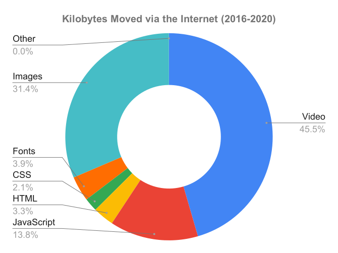
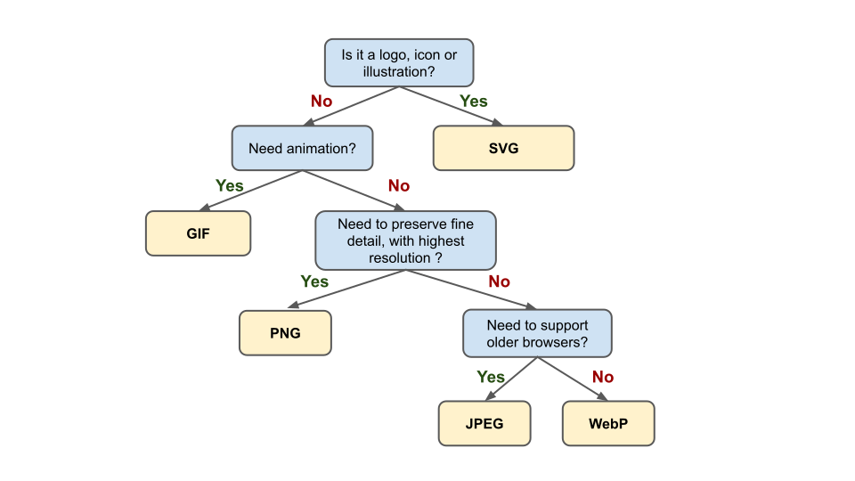
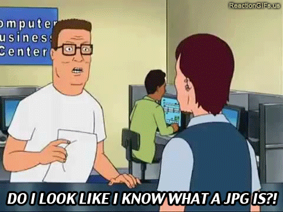

# Image Compression

Most image file formats such as `.png`, `.jpeg` and `.gif` have the ability to
undergo compression.

This is similar to compressing text files using `.zip` or `.7z`, however, the
compression process is built into the image file itself.

> The image file is first compressed when it is created and it is de-compressed
> every time it is used.

 

Choosing the correct image format along it's compression type is important
because there there is a correlation between page load time and visitor's bounce
rate.

 

## Why optimize images ?

Page load times are directly related to
[bounce rates](https://support.google.com/analytics/answer/1009409?hl=en): that
is, the longer a page loads, the more likely a user is to navigate away from
that page without clicking on anything. Bounce rates are measured regularly
across the internet, allowing us to confirm empirically this fairly intuitive
idea: a difference of just a few seconds drastically increases the likelyhood a
user will click away from a webpage.

 

<a href="https://www.pingdom.com/blog/page-load-time-really-affect-bounce-rate/">image source</a>

- [Cloudflare reports that going from 5.7s to 2.4s load time triples the conversion rate](https://www.cloudflare.com/learning/performance/more/website-performance-conversion-rates/)
- [Akamai reports that a two-second delay in web page load time increase bounce rates by 103%](https://www.akamai.com/uk/en/about/news/press/2017-press/akamai-releases-spring-2017-state-of-online-retail-performance-report.jsp)

Slow pages are very frustrating to use, this is pretty easy to understand.

 

**How do we lower page load time?**

Let's look at what we are loading:

 

<a href="https://httparchive.org/reports/page-weight?view=grid"><em>HTTP Archive - Page Weight Report</em></a>

 

Most of the data moved over the Internet are videos, **however**:

- Videos are typically not downloaded at initial load time (you have to hit
  play);
- Most pages don't serve videos (only 2 out of 76 resource requests are videos);

 

> The next largest asset type slowing down load times are images.

 

In order to reduce image load times we can focus on the following approaches:

 

1. **Choosing the right image format;**
2. **Optimize compression;**
3. Use responsive images;
4. Lazy-load images;

 

> Image optimization is both an art and science: an art because there is no one
> definitive answer for how best to compress an image, and a science because
> there are many techniques that can significantly reduce the size of an image.
>
> \- Ilya Grigorik , web performance engineer at Google

 

## Choosing the image format

Here is the summary table for all the formats we've looked at:

 

|                           **Format**                            | **Type** | **Transparency** | **Animation** | **Lossy** | **Lossless** |
| :-------------------------------------------------------------: | :------: | :--------------: | :-----------: | :-------: | :----------: |
| [GIF](http://en.wikipedia.org/wiki/Graphics_Interchange_Format) |  Raster  |       Yes        |      Yes      |    No     |     Yes      |
|  [PNG](http://en.wikipedia.org/wiki/Portable_Network_Graphics)  |  Raster  |       Yes        |      No       |    No     |     Yes      |
|            [JPEG](http://en.wikipedia.org/wiki/JPEG)            |  Raster  |        No        |      No       |    Yes    |     No\*     |
|            [WebP](http://en.wikipedia.org/wiki/WebP)            |  Raster  |       Yes        |      Yes      |    Yes    |     Yes      |
|     [SVG](https://developer.mozilla.org/en-US/docs/Web/SVG)     |  Vector  |       Yes        |      Yes      |    No     |     Yes      |

\*_Lossless compression is part of the jpeg standard but rarely supported by
programs and browsers._

 

While there is no definite answer, below is a recommendation based on a few
basic questions:

 

<a href="https://developers.google.com/web/fundamentals/performance/optimizing-content-efficiency/image-optimization#eliminating_and_replacing_images"><em>Adapted from "Image Optimization" by developers.google.com</em></a>

 

You can get a sense of the reasoning behind this chart by reviewing the previous
set of slides on [image resolution](./images_resolution). The general principle
is: use the smallest file format available that meets the minimum display
requirements.

## Optimizing Compression

Image compressors use a variety of techniques to lower the number of required
bits per pixel in order to reduce file size.

 

There are two types of compression:

- Lossy
- Lossless

 

Differences in image formats are largely due to how compatible they are with
lossy and lossless compression algorithms.

 

### Lossy

In lossy compression some **information is lost** during compression. This is
because lossy compression reduces files size by approximating the original image
-- this approximation destroys some of the image quality to achieve reduced file
size.

**This process is irreversible.** However, when done properly, the loss in
quality is barely noticeable.

<a href="https://technofaq.org/posts/2018/02/pitfalls-to-avoid-when-choosing-images-for-your-webpage/"><em>Image by technofaq.org</em></a>. Right click and open this image in a new tab -- zoom in on each panel to observe the compression artefacts (blurred pixels) introduced in the compressed images.

 

Lossy compression algorithms reduce image size by:

- Simplifying or reducing the number of pixels;
- Reducing the number of colors (color palette).

 

**Simplifying pixels**

It is possible to "group" neighboring pixels and apply the same color to the
whole group.

For example, in the animation below, pixels are grouped to progressively
simplify the image:

 

 

**Reducing the color palette**

In the image below, the same picture is exported using different color palettes
(colors available to "paint" the image).

From left to right (PNG): 32-bit (4 channels, 16M colors), 7-bit (128 colors),
5-bit (32 colors).

 

<a href="https://developers.google.com/web/fundamentals/performance/optimizing-content-efficiency/image-optimization#eliminating_and_replacing_images"><em>Image Optimisation - developers.google.com</em></a>

 

### Lossless

In lossless compression **no information is lost** during compression. Images
before and after compression are **identical**.

> Lossless compression shrinks images by replacing and substituting patterns
> observed in the pixel grid.

This is done similarly to how `.zip` files are compressed. **This process is
perfectly reversible.**

 

For example, in the image below (pixels are laid out as a pixel array), patterns
are simplified by listing the repetitions in color (run-length encoding).

 

<a href="https://technofaq.org/posts/2018/02/pitfalls-to-avoid-when-choosing-images-for-your-webpage/"><em>Image by technofaq.org</em></a>

 

## Compression Tools

The compression type and quality levels are chosen when the image is created or
when using conversion software.

 

Some online services offer the ability to optimize and further compress images:

- [TinyPNG](https://tinypng.com/) and [TinyJPG](https://tinyjpg.com/)
- [CompressPNG](https://compresspng.com/) and
  [CompressJPEG](https://compressjpeg.com/)
- [SVGOMG](https://jakearchibald.github.io/svgomg/)
- [ezgif.com](https://ezgif.com/optimize)

 

> In practice, image optimization is typically a combination of lossy **and**
> lossless compression.
>
> Always optimize compression before adding images to your production website!

 

## Diving Deeper (optional)

The video below does a great job summarizing two lossless compression
techniques:

- Run-length encoding,
- Huffman dictionary

Carrie Anne, the host of this YouTube series, is a computer science teacher and
director of education of the Raspberry Pi Foundation.

<iframe width="560" height="315" src="https://www.youtube.com/embed/OtDxDvCpPL4" frameborder="0" allow="accelerometer; autoplay; clipboard-write; encrypted-media; gyroscope; picture-in-picture" allowfullscreen></iframe>
