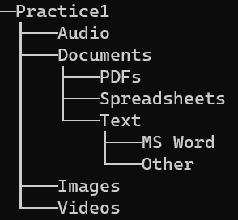

## Lab: File Compression

In LEA, you will find  **Lab: File Compression** under the list of assignments. The instructions below are similar to the instructions given on LEA. If there are any contradictions between the instructions, defer to those which came from LEA. 

1. Download the file: ***File Compression***

2. Decompress it in a location of your choice

3. Create a `.txt` file named `compression_size`.

4. Inside `compression_size.txt` take note of the size of each file. You will need this information for a later step.

5. Compress **each file indivudually**.

6. Take note of the file size after compression. You will need this for a later step.

7. Create a main folder named ***Practice1***. This will be the top level directory for the next steps.

8. Create the file structure shown below (only directories are shown).

     

9. Place the **compressed files** in their respective folders, according to their original file type (before compression).

10. Delete any **uncompressed files**.

11.  Inside `compression_size.txt` write down the compression ratios for each file that you compressed.

   - Compression ratio = 1 - ( final size / initial size )

12. Inside `compression_size.txt`, write down which files have the the best and worse file compression.

13. Include `compression_size.txt` in the top level directory of this activity.

14. Compress the top level directory *Practice 1.*

15. Upload the final compressed folder to LEA under Lab 1 -- File Compression.