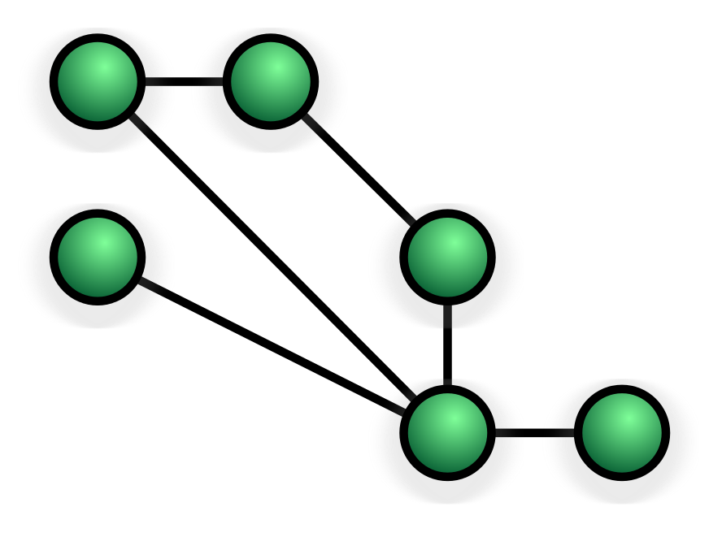

This set of slides covers material from Assignment 3 (see LEA) that is not already discussed in earlier slides.

 

# Networking tools: ping

) The description below is sourced from wikipedia:

[ping](https://wikiless.org/wiki/Ping_(networking_utility)) is a computer network administration software utility used to test the reachability of a host on an Internet Protocol (IP) network. 

Ping measures the round-trip time for messages sent from the originating host to a destination computer that are echoed back to the source. The name comes from active sonar terminology that sends a pulse of sound and listens for the echo to detect objects under water.

Ping operates by means of Internet Control Message Protocol (ICMP) packets. Pinging involves sending an ICMP echo request to the target host and waiting for an ICMP echo reply. The program reports errors, packet loss, and a statistical summary of the results, typically including the minimum, maximum, the mean round-trip times, and standard deviation of the mean. 

# Network security: firewalls

[Firewalls](https://wikiless.org/wiki/Firewall_(computing)) are network security applications that allow users to set **security rules** governing the flow of packets between a trusted network (say, a home or work LAN) to the broader Internet. The most common set of security rules controlled by firewalls concern **ports**, numbers that are assigned to uniquely identify a connection endpoint and to direct data to a specific service. For example, a firewall can block all traffic on port 27015 (which is one of the ports that the video game application Steam uses for communication with your operating system). The main goal of firewalls is to allow desired communciation to flow to the correct service, while blocking all other communication that is not desired.

# Network topology: The many ways to connect many machines

Network **topology** defines the set of direct connections (paths) between machines in a network.
* Topology in general: a mathematical concept describing the geometric relationships between components of an object.
* In networking: Whether you are conscious of it or not, all networks have a defined topology (the set of connections between machines). It turns out, there are a limited number of possiblities and we can define/compare them all.
* We call network devices **nodes** and the connections between them **edges** or **paths**.

Example topologies:

## Bus topology

* All devices are connected by a single cable known as the **back-bone** cable.
* Advantages: requires less cables, easy to add new node to network
* Disadvantages: the entire network fails if the back-bone breaks; difficult to identify which node caused the break

## Ring topology

* Data travels around the ring, stopping at each node. If a node wants to transmit data, it adds the data as well as the destination address to the data.
* Data continues around the ring until it finds the destination node, which takes the data out of the frame.
* Single ring: all devices share one cable. Dual ring: all devices share two cables (bidirectional)
* Advantages: Better performance than Bus topology, easier to identify malfunctioning devices than Bus topology
* Disadvantages: Similar to Bus topology, one malfunctioning device can disrupt the entire network (especially with single ring); adding new devices changes the network structure and increases network delay/reduces bandwidth

## Star/Tree topology

* Star topology: Every node is connected directly to a central networking hub/switch.
* Tree topology: multiple Star topology networks connected into a larger Tree of networks.
* Advantages: a single node or connection failure will not affect the network; nodes can be added or removed without affecting the network; bandwidth not shared across all devices
* Disadvantages: more expensive, each node requires a dedicated cable to the central device; the central device is a single point of failure for the entire network

## Mesh topology

* **Left**: a Fully Connected Mesh Network (all nodes connected to all other nodes)
* **Right**: a Partially Connected Mesh Network (some nodes with multiple connections to other nodes, no central node)
* Most nodes are connected to many other nodes for redundancy and fault tolerance.
* Used in WANs to interconnect LANs; used for high availability/critical networks
* Advantages: fault tolerance, high bandwidth, devices independent, no single point of failure
* Disadvantages: expensive and difficult to maintain

